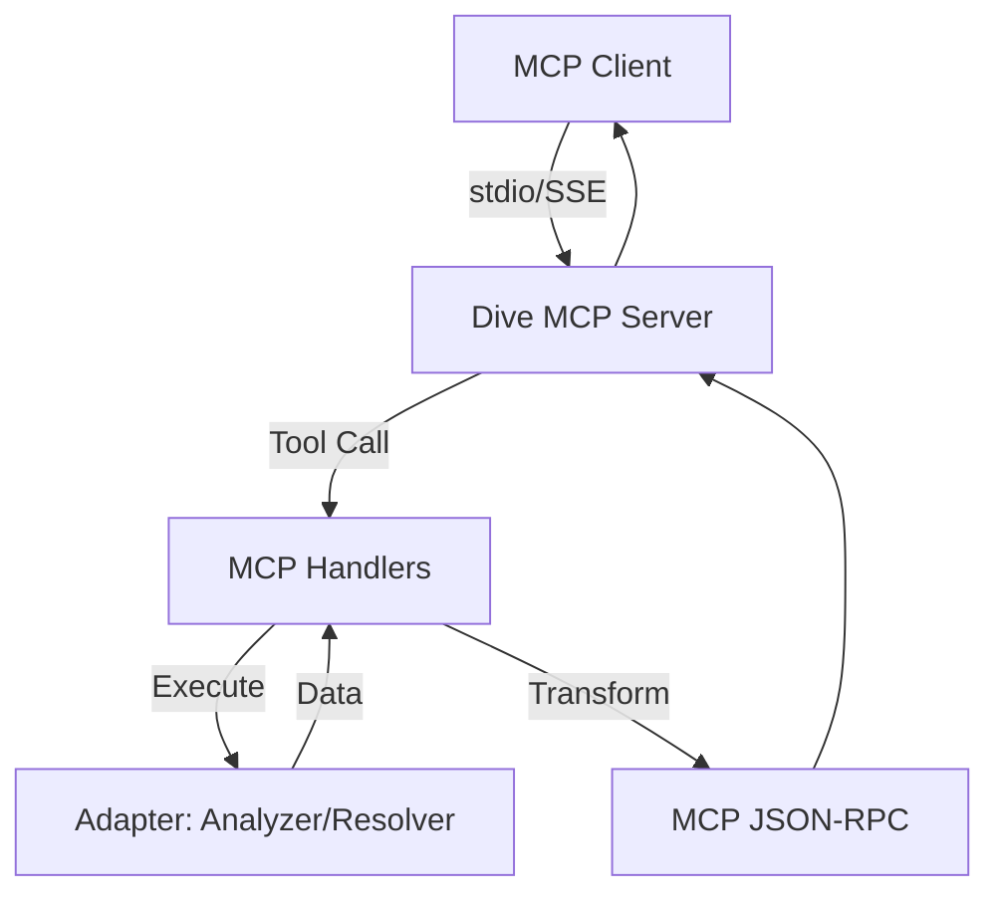

# Dive MCP Server: High-Level Design & Implementation Plan

## 1. Overview
This document outlines the design and architecture for integrating Model Context Protocol (MCP) support into the `dive` project. The goal is to allow AI agents (via MCP clients) to programmatically analyze Docker/OCI images, inspect layer contents, and identify optimization opportunities using `dive`'s existing analysis engine.

## 2. Architecture

### 2.1 Component Integration
The MCP server will be implemented as a new subcommand within the existing `clio`/`cobra` CLI framework. It will act as a "headless" consumer of the core `dive` domain, similar to the CI evaluator or the JSON exporter.

*   **Command Layer:** `cmd/dive/cli/internal/command/mcp.go`
*   **MCP Logic Layer:** `cmd/dive/cli/internal/mcp/`
*   **Domain Re-use:** Leverages `dive/image`, `dive/filetree`, and `cmd/dive/cli/internal/command/adapter`.

### 2.2 System Diagram

### 2.3 MCP Protocol (Version 2025-11-25) Implementation
The server will support the following capabilities:

#### Tools
*   `analyze_image(image_path, source)`: Returns high-level efficiency metrics and layer metadata.
*   `inspect_layer(image_path, layer_id)`: Returns file tree changes for a specific layer.
*   `get_wasted_space(image_path)`: Returns a list of inefficient files and cumulative size.

#### Resources
*   `dive://image/{name}/summary`: Provides the latest analysis summary.
*   `dive://image/{name}/efficiency`: Provides the efficiency score and metrics.

#### Prompts
*   `optimize-dockerfile`: A template that assists the AI in rewriting a Dockerfile based on `dive`'s findings.

## 3. Implementation Plan

### Phase 1: Foundation (Research & Scaffolding)
*   **Dependency Management:** Introduce `github.com/mark3labs/mcp-go` (lightweight MCP SDK for Go).
*   **Subcommand Registration:** Add `mcp` command to `cmd/dive/cli/cli.go`.
*   **Options:** Implement `options.MCP` for configuration (e.g., transport type, timeouts).

### Phase 2: Server & Transport Logic
*   **Stdio Transport:** Implement the primary communication channel for local MCP clients.
*   **HTTP/SSE Transport:** Implement an optional `--http` mode for streamable MCP over network/web containers.
*   **Session Management:** Implement a simple in-memory cache to prevent re-analyzing the same image across multiple tool calls in a single session.

### Phase 3: Tool Handlers & Data Mapping
*   **Handler Logic:** Map MCP tool requests to `adapter.NewAnalyzer().Analyze()`.
*   **Data Pruning:** Implement depth-limited tree serialization to ensure MCP responses stay within protocol/client token limits.
*   **Progress Notifications:** Integrate with `internal/bus` to stream analysis progress back to the MCP client.

### Phase 4: Validation & Quality Control
*   **Unit Testing:** Add tests for MCP handlers in `cmd/dive/cli/internal/mcp/`.
*   **Snapshot Testing:** Use `go-snaps` to verify MCP JSON-RPC outputs.
*   **Quality Gates:** Ensure compliance with `golangci-lint` and the 25% coverage threshold via `Taskfile`.

### Phase 5: Release
*   **Release Process:** No changes required to `goreleaser`; the `mcp` subcommand will be included in the standard `dive` binary.
*   **Documentation:** Update `README.md` and provide a `dive-mcp-config.json` example for Claude Desktop.

## 4. Design Constraints
*   **Zero Impact on TUI:** The MCP server will not initialize `gocui` or the terminal UI.
*   **Dependency Minimalization:** Only one new dependency (`mcp-go`) will be added.
*   **Standards Compliance:** Strict adherence to Go 1.24 and existing error handling patterns.
